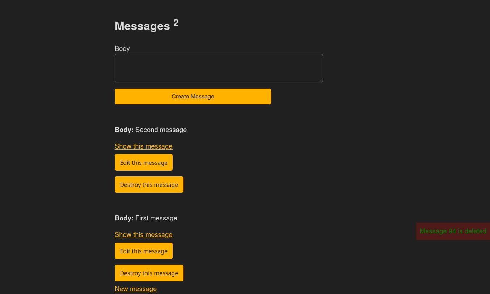

# Message App 

> This is a project to learn how to use Turbo.

> Message App!

## Description

Messages can be shared on this application fastly and easily. 

## Features

* Creating a message
* Reading all messages
* Updating any message
* Deleting any message

## Built with

- Ruby v3.0.2
- Ruby on Rails v7.0.3
- Turbo
- Git
- Simple.css

## Live demo

It will be added later.

## Setup

- Clone this repository
- Open terminal
- Change directory by using `cd message_app/`
- Run `bundle install`
- Run `rails db:migrate`
- Open rails server by using `rails s`
- Open browser and go to http://localhost:3000

## Test app

- Tests will be added.

## Deploy to Heroku

- Sign in [Heroku](https://www.heroku.com/).
- Open your terminal.
- Run `heroku login`. If you get any error, run `sudo snap install --classic heroku` and [check](https://devcenter.heroku.com/articles/heroku-cli).
- Create an app by running `heroku create name-of-app`. You may use any name for name of your Heroku app.
- If you are using sqlite3 for database, update 'database.yml' file by [following steps](https://devcenter.heroku.com/articles/sqlite3).
- If you are using master branch,run `git push heroku main`. If you are using another branch, run `git push heroku +HEAD:main`.
- Run `heroku run rake db:migrate` your terminal.
- Open your app from your [dashboard of heroku](https://dashboard.heroku.com/).
- Push 'Open app' button to access your app from your dashboard of Heroku.

## Authors

Reach out to me at one of the following places!

👤 **Hasan Özovalı**

- LinkedIn: [Hasan Ozovali](https://www.linkedin.com/in/hasan-ozovali/)
- Github: [@ozovalihasan](https://github.com/ozovalihasan)
- Twitter: [@ozovalihasan](https://twitter.com/ozovalihasan)
- Mail: [ozovalihasan@gmail.com](ozovalihasan@gmail.com)

## Contributing 🤝

Contributions, issues, and feature requests are welcome!

Feel free to check the [issues page](https://github.com/ozovalihasan/message_app/issues).

## Acknowledgments

Thanks to

- [@corsego](https://github.com/corsego) for [the amazing tutorial](https://www.youtube.com/watch?v=csvaYIaBYpw&ab_channel=SupeRailsbyYaroslavShmarov). I watched and followed each step shown in the video and it helped me to understand Turbo more. Also, I changed some parts.

## Show your support

Give a ⭐️ if you like this project!

## License

- **[MIT license](http://opensource.org/licenses/mit-license.php)**
